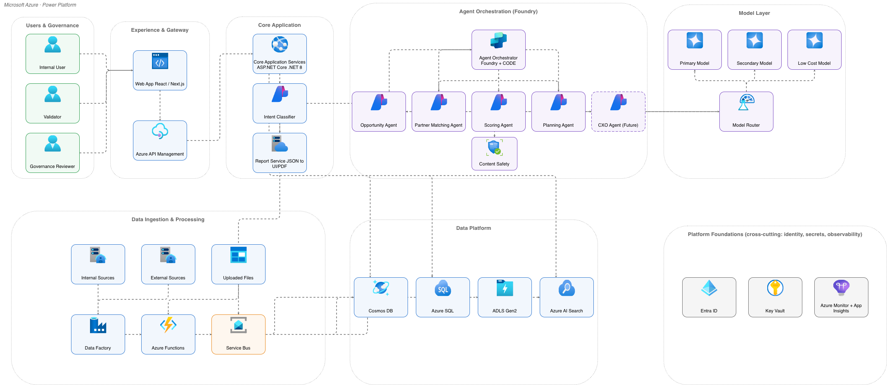

# Azure Diagrams

**Azure Architecture Assistant** — turn Mermaid definitions or plain-language architecture descriptions into presentation-ready, editable draw.io diagrams with official Microsoft Azure and Power Platform icons, generated and refined conversationally inside Claude.

[](CHANGELOG.md)
[](LICENSE)
[](https://github.com/juliopessan/azure-diagrams-plugin)

## The story

### The gap this closes

Mermaid is great at expressing what an architecture *is* — components, dependencies, order, boundaries. It is not great at expressing what an architecture *means* to the person reviewing it. Auto-layout positioning, generic connectors, and inconsistent iconography rarely survive contact with a CIO review, an Architecture Review Board, or a client-facing slide. So architects redraw it by hand — and the result varies by author, by mood, by how much time is left before the meeting.

Azure Architecture Assistant exists to close that gap without asking the architect to leave the conversation they're already having with Claude.

### Mermaid as source of truth, not as layout

The core idea is simple: treat the supplied Mermaid (or a plain-language description) as the *logical* source of truth, and let Claude own the *visual* decisions — zone grouping, dominant-flow narrative, official Microsoft iconography, whitespace, and connector routing. Business logic, data flows, execution order and security boundaries are preserved exactly; positioning, hierarchy and presentation are redesigned for a five-second read.

Every request is isolated. Nothing from a prior diagram — topology, labels, assumptions — leaks into the next one.

### From Mermaid to boardroom, in one conversation

1. **Submit** — supply a new Mermaid or describe the architecture in plain language.
2. **Scope** — Claude identifies the dominant flow and any ambiguity worth a quick clarification.
3. **Analyze** — users, applications, integration, AI/agent orchestration, data, identity, security, monitoring and exceptions get mapped to a semantic model.
4. **Resolve icons** — official Microsoft assets are looked up live (`search_shapes`), never guessed.
5. **Compose** — native draw.io XML is generated across four mandatory layers: Zones, Connectors, Nodes, Annotations.
6. **Validate** — the render call itself is the quality gate; structural errors surface immediately, not after delivery.
7. **Deliver** — a native, editable `.drawio` file, the source Mermaid/XML, an inline preview, and a short note on what was decided.
8. **Iterate** — *"the connectors are cluttering the view, fix it"* is a valid next message. Claude regenerates and re-renders in place.

That last step is what makes this different from a one-shot generator: revision is conversational, not a trip back into a design tool.

### Proof, not promises

The `examples/agentic-sales-intelligence/` case study is the plugin exercising itself end to end, warts and all:



*Rendered directly from `v3-final.drawio` — 32 nodes, 8 zones, official azure2 icons, `routing: "libavoid"` connectors. Open the `.drawio` file yourself to confirm every shape is still natively editable, not a flattened export.*

| | v1 | v2 | v3 (final) |
|---|---|---|---|
| Connectors | 41 | 41 | **34** (-17%) |
| What changed | First render from the supplied Mermaid | Fixed legend overlap, detangled the Model Layer connector fan | Removed cross-cutting and duplicate edges on explicit user request; rendered with `routing: "libavoid"` |

No connector was removed by guesswork — each revision was a direct response to a visual defect the user actually flagged, and each version still renders clean through the same validation gate. That's the evidence this plugin's claims are built on, not a demo cherry-picked to look good.

### Where this is going

Version 0.1.0 is the technical foundation: plugin packaging, the `azure-diagram` Skill, official MCP integration, and one fully iterated reference architecture. The next milestones — laid out in `docs/Azure-Architecture-Assistant-Claude-Edition.docx` — are a controlled pilot with real architects and a real baseline, then a public release path so any team can install this as a shared capability rather than a personal script. Read the full submission document for the complete use case, KPI framework, risk assessment and roadmap.

---

## What it does

- **`azure-diagram` Skill** — the full generation pipeline: narrative reconstruction, semantic zone-based layout (16:9 by default, extendable for dense architectures), four mandatory draw.io layers (`Zones`, `Connectors`, `Nodes`, `Annotations`), color-coded cards and connectors, anti-overlap/anti-crossing routing, validated official icons (`azure2` set via live shape search), legend strip, and a quality scorecard. All diagram content in EN-US.
- **draw.io MCP server** — connects the official `https://mcp.draw.io/mcp` endpoint, providing `create_diagram` (structural validation + interactive rendering, with optional `postLayout: "elk"` auto-layout or `routing: "libavoid"` obstacle-avoiding edge routing) and `search_shapes` (official icon discovery — no hard-coded/guessable icon paths).

## Usage

Ask Claude for an Azure diagram, paste a Mermaid flowchart, or say "convert this to draw.io." Outputs: a native, editable `.drawio` file (wrapped in a valid `mxfile` container), the source Mermaid/XML, an inline rendered preview, and a short summary of the design choices made.

Because generation happens inside the conversation, revisions are conversational too — for example:

- *"The connectors are cluttering the visual, reduce them."*
- *"Move Content Safety directly under the orchestrator."*
- *"Render this with cleaner obstacle-avoiding routing."*

Claude regenerates the XML, re-renders it through `create_diagram`, and reports exactly what changed.

## Repository layout

```
azure-diagrams/
├── .claude-plugin/plugin.json   # plugin manifest
├── .mcp.json                    # official draw.io MCP endpoint
├── skills/azure-diagram/        # the Skill: design system, layout rules, quality gates
├── examples/                    # end-to-end reference architecture, iterated v1 → v3
│   └── agentic-sales-intelligence/
├── docs/                        # project submission document (Claude edition)
├── CHANGELOG.md
└── LICENSE
```

## Reference example: Agentic Sales Intelligence Platform

`examples/agentic-sales-intelligence/` walks through a real end-to-end generation and revision cycle for a 30+ node Azure architecture (agent orchestration, model routing, data platform, ingestion, platform foundations):

| File | What it shows |
|---|---|
| `v1.drawio` | First render from the supplied Mermaid — 32 nodes, 41 connectors, 8 zones. |
| `v2.drawio` | Fixed legend overlap and detangled the Orchestration ↔ Model Layer connector fan. |
| `v3-final.drawio` / `preview-v3.png` | Decluttered on request — cross-cutting and duplicate edges removed, 41 → 34 connectors (-17%), rendered with `routing: "libavoid"`. |

Open any file directly in [draw.io](https://app.diagrams.net) or the desktop app.

## Install

```bash
git clone https://github.com/juliopessan/azure-diagrams-plugin.git
```

Then enable it as a Claude plugin (Cowork mode or Claude Code) pointing at the cloned folder — it ships its own `.mcp.json` wiring the official draw.io MCP endpoint, so no extra server setup is needed.

## Requirements

- Claude Desktop (Cowork mode) or Claude Code with plugin support.
- Internet access to `mcp.draw.io` (diagram rendering/validation) and `app.diagrams.net` (icon asset loading).

## Project submission

`docs/Azure-Architecture-Assistant-Claude-Edition.docx` is the full project write-up (use case, solution details, user journey, technology, KPIs, and roadmap), separating what's technically validated today from what's a pilot target.

## Contributing / versioning

See [CHANGELOG.md](CHANGELOG.md) for release history and known gotchas. Version follows the `plugin.json` manifest.

## License

[MIT](LICENSE) — see the license file for details.
