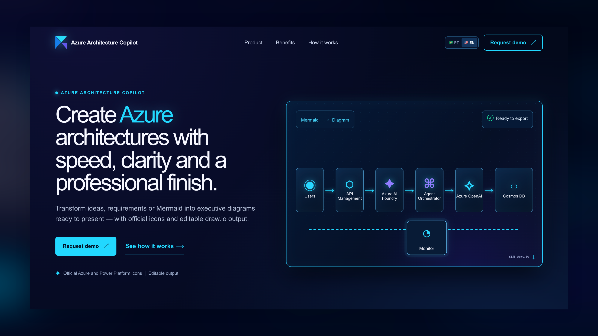
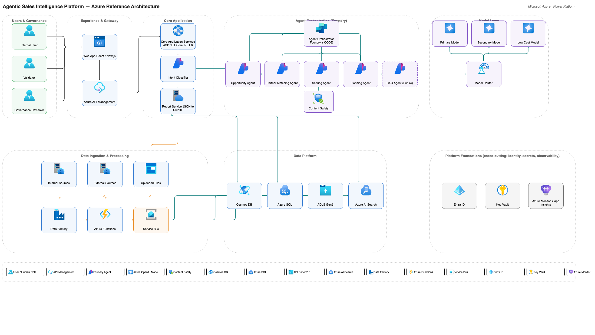

# Azure Diagrams

**Azure Architecture Assistant** — turn Mermaid definitions or plain-language architecture descriptions into presentation-ready, editable draw.io diagrams with official Microsoft Azure and Power Platform icons, generated and refined conversationally inside Claude.

[](CHANGELOG.md)
[](LICENSE)
[](https://github.com/juliopessan/azure-diagrams-plugin)

**→ [Landing page](https://juliopessan.github.io/azure-diagrams-plugin/)** · [Rule table](skills/azure-diagram/DIAGRAM-RULES.md) · [Examples](examples/)



## The gap this closes


Mermaid is great at expressing what an architecture *is* — components, dependencies, order, boundaries. It is not great at expressing what an architecture *means* to the person reviewing it. Auto-layout positioning, generic connectors, and inconsistent iconography rarely survive contact with a CIO review, an Architecture Review Board, or a client-facing slide. So architects redraw it by hand — and the result varies by author, by mood, by how much time is left before the meeting.

Azure Architecture Assistant exists to close that gap without asking the architect to leave the conversation they're already having with Claude.

### Mermaid as source of truth, not as layout

The core idea is simple: treat the supplied Mermaid (or a plain-language description) as the *logical* source of truth, and let Claude own the *visual* decisions — zone grouping, dominant-flow narrative, official Microsoft iconography, whitespace, and connector routing. Business logic, data flows, execution order and security boundaries are preserved exactly; positioning, hierarchy and presentation are redesigned for a five-second read.

Every request is isolated. Nothing from a prior diagram — topology, labels, assumptions — leaks into the next one.

### From Mermaid to boardroom, in one conversation

1. **Submit** — supply a new Mermaid or describe the architecture in plain language.
2. **Scope** — Claude identifies the dominant flow and any ambiguity worth a quick clarification.
3. **Analyze** — users, applications, integration, AI/agent orchestration, data, identity, security, monitoring and exceptions get mapped to a semantic model.
4. **Resolve icons** — official Microsoft assets are looked up live (`search_shapes`), never guessed.
5. **Compose** — native draw.io XML is generated across four mandatory layers: Zones, Connectors, Nodes, Annotations.
6. **Validate** — the render call itself is the quality gate; structural errors surface immediately, not after delivery.
7. **Deliver** — a native, editable `.drawio` file, the source Mermaid/XML, an inline preview, and a short note on what was decided.
8. **Iterate** — *"the connectors are cluttering the view, fix it"* is a valid next message. Claude regenerates and re-renders in place.

That last step is what makes this different from a one-shot generator: revision is conversational, not a trip back into a design tool.

### Proof, not promises

The `examples/agentic-sales-intelligence/` case study is the plugin exercising itself end to end, warts and all:



*Rendered directly from `agentic-sales-intelligence.drawio` — 32 nodes, 8 zones, official azure2 icons, `routing: "libavoid"` connectors. Open the `.drawio` file yourself to confirm every shape is still natively editable, not a flattened export.*

| Metric | First render | Final (shipped) |
|---|---|---|
| Connectors | 41 | **34** (-17%) |
| Legend & routing | Overlapping legend labels, tangled Model Layer connector fan | Clean legend, `routing: "libavoid"` obstacle-avoiding paths |

No connector was removed by guesswork — every change was a direct response to a visual defect flagged during review, and the result still renders clean through the same validation gate. Only this final, validated architecture ships in `examples/`; the full before/after history is recorded in [CHANGELOG.md](CHANGELOG.md). That's the evidence this plugin's claims are built on, not a demo cherry-picked to look good.

### Where this is going

v0.1.0 laid the technical foundation: plugin packaging, the `azure-diagram` Skill, official MCP integration, and one validated reference architecture. v0.2.0 made the quality claims auditable — `AZD-xxx` rule codes, explicit mode selection, and a non-destructive audit that found four real defects in an already-shipped diagram.

What is *not* done yet, stated plainly: three of the five diagram modes (Sequence, Data Flow, Lifecycle) are documented as roadmap and deliberately not attempted; there is no automated test suite, because the quality gate is the MCP render plus a human look; and no timing study exists, so this repo makes no hours-saved claim. The next milestones — laid out in `docs/Azure-Architecture-Assistant-Claude-Edition.docx` — are a controlled pilot with real architects against a real baseline, then a public release path so any team can install this as a shared capability rather than a personal script.

---

## What it does

- **`azure-diagram` Skill** — the full generation pipeline: narrative reconstruction, semantic zone-based layout (16:9 by default, extendable for dense architectures), four mandatory draw.io layers (`Zones`, `Connectors`, `Nodes`, `Annotations`), color-coded cards and connectors, anti-overlap/anti-crossing routing, validated official icons (`azure2` set via live shape search), legend strip, and a quality scorecard. All diagram content in EN-US.
- **draw.io MCP server** — connects the official `https://mcp.draw.io/mcp` endpoint, providing `create_diagram` (structural validation + interactive rendering, with optional `postLayout: "elk"` auto-layout or `routing: "libavoid"` obstacle-avoiding edge routing) and `search_shapes` (official icon discovery — no hard-coded/guessable icon paths).

## Usage

Ask Claude for an Azure diagram, paste a Mermaid flowchart, or say "convert this to draw.io." Outputs: a native, editable `.drawio` file (wrapped in a valid `mxfile` container), the source Mermaid/XML, an inline rendered preview, and a short summary of the design choices made.

Because generation happens inside the conversation, revisions are conversational too — for example:

- *"The connectors are cluttering the visual, reduce them."*
- *"Move Content Safety directly under the orchestrator."*
- *"Render this with cleaner obstacle-avoiding routing."*

Claude regenerates the XML, re-renders it through `create_diagram`, and reports exactly what changed.

## Rule codes and mode selection (v0.2.0)

Two additions on top of the same pipeline and visual style — nothing about how diagrams look changed, only how the Skill self-checks and reports on them:

- **`AZD-xxx` rule codes** — every rule in the design system has a stable diagnostic code (`AZD-0xx` pipeline/setup · `1xx` canvas & layers · `2xx` visual style · `3xx` anti-overlap, e.g. `AZD-301` = arrow crosses text · `4xx` icons · `5xx` layout & narrative · `6xx` language & legend). When Claude self-corrects a diagram, it cites the code instead of describing the fix in prose — so a delivery can say *"0 open AZD violations"* instead of a vague "looks good."
- **Explicit mode selection** — before laying anything out, Claude names which mode governs the diagram: **Flowchart** (decision/status flows — approval, triage, routing) or **Architecture** (system topology — service/data/integration layers), each with its own connector color palette. Sequence, Data Flow and Lifecycle modes are on the roadmap but not implemented; the Skill says so rather than faking one.
- **Audit without regeneration** — an already-shipped `.drawio` can be re-validated against the current rule set (MCP structural check + full `AZD-xxx` pass) without touching a single node. Run against `examples/agentic-sales-intelligence/` — generated under v0.1.0, before the codes existed — the pass surfaced four real defects (`AZD-101` missing white background, `AZD-201` connectors ignoring the mode palette, `AZD-602` legend icons overlapping their labels, `AZD-001` no companion Mermaid source). All four were fixed; the example now sits at 0 open violations. The audit is worth having precisely because it did *not* come back clean.

Full rule table, severities and the audit workflow: [`skills/azure-diagram/DIAGRAM-RULES.md`](skills/azure-diagram/DIAGRAM-RULES.md). See [CHANGELOG.md](CHANGELOG.md) for the complete v0.2.0 entry.

## Repository layout

```
azure-diagrams-plugin/
├── .claude-plugin/
│   ├── plugin.json                  # plugin manifest
│   └── marketplace.json             # marketplace entry
├── .mcp.json                        # official draw.io MCP endpoint
├── skills/azure-diagram/
│   ├── SKILL.md                     # the Skill: design system, layout rules, quality gates
│   └── DIAGRAM-RULES.md             # canonical AZD-xxx rule table + audit workflow
├── examples/                        # validated, re-runnable reference architectures
│   ├── agentic-sales-intelligence/  # .drawio + .mmd + preview.png
│   └── solution-platform/           # .drawio + .mmd
├── docs/
│   ├── index.html                   # landing page (GitHub Pages)
│   └── Azure-Architecture-Assistant-Claude-Edition.docx
├── assets/hero.png
├── CHANGELOG.md
└── LICENSE
```

## Reference examples

Two validated architectures ship in `examples/`. Each carries the Mermaid source beside the `.drawio`, so the pipeline can be re-run against the same input and the output compared.

### Agentic Sales Intelligence Platform

`examples/agentic-sales-intelligence/` — the final, validated output of a real end-to-end generation and revision cycle for a 30+ node Azure architecture (agent orchestration, model routing, data platform, ingestion, platform foundations): **32 nodes, 8 zones, 34 connectors**, official `azure2` icons, rendered with `routing: "libavoid"`. Audited against the v0.2.0 rule set — 0 open violations.

| File | What it is |
|---|---|
| `agentic-sales-intelligence.drawio` | Final architecture — native, editable draw.io XML. |
| `agentic-sales-intelligence.mmd` | Mermaid source, reconstructed to match the shipped topology exactly. |
| `preview.png` | Rendered preview for a quick look before opening the file. |

### Solution Platform

`examples/solution-platform/` — a conventional enterprise stack generated from a supplied Mermaid flowchart: **16 nodes, 5 zones, 13 connectors** across Access, Application Tier, Data & AI Platform, Security & Governance, and Integration & Enterprise Adapters. Useful as the "ordinary case" counterweight to the agentic example.

| File | What it is |
|---|---|
| `solution-platform.drawio` | The architecture — native, editable draw.io XML. |
| `solution-platform.mmd` | The exact Mermaid flowchart it was generated from. |

Two nodes in this one carry proxy icons marked `*` in the legend (Desktop Browser, Document Repository) — no official `azure2` asset exists for either, and the Skill flags that rather than passing off a lookalike as official.

Open either `.drawio` directly in [draw.io](https://app.diagrams.net) or the desktop app.

## Install

```bash
git clone https://github.com/juliopessan/azure-diagrams-plugin.git
```

Then enable it as a Claude plugin (Cowork mode or Claude Code) pointing at the cloned folder — it ships its own `.mcp.json` wiring the official draw.io MCP endpoint, so no extra server setup is needed.

## Requirements

- Claude Desktop (Cowork mode) or Claude Code with plugin support.
- **Network access to `mcp.draw.io` and `app.diagrams.net` is required.** The Skill validates and renders diagrams through the official draw.io MCP endpoint (`https://mcp.draw.io/mcp`) and resolves official icons by fetching them from `app.diagrams.net`. If your network blocks either domain (corporate proxy/firewall), diagram generation and validation will fail — check with your network/IT team before rolling this out to a team.

## Landing page

`docs/index.html` is a self-contained landing page for the project — no build step, no dependencies, one file. To serve it at <https://juliopessan.github.io/azure-diagrams-plugin/>, enable GitHub Pages once: **Settings → Pages → Source: Deploy from a branch → `main` / `/docs`**. Until that is switched on, the link above 404s; the file still opens fine locally in any browser.

Its proof panel carries only counts taken from this repository — the connector census and the `AZD-xxx` audit — and says so on the page. No hours-saved figure is claimed anywhere, because no timing study has been run.

## Project submission

`docs/Azure-Architecture-Assistant-Claude-Edition.docx` is the full project write-up (use case, solution details, user journey, technology, KPIs, and roadmap), separating what's technically validated today from what's a pilot target.

## Contributing / versioning

See [CHANGELOG.md](CHANGELOG.md) for release history and known gotchas. Version follows the `plugin.json` manifest.

## License

[MIT](LICENSE) — see the license file for details.
